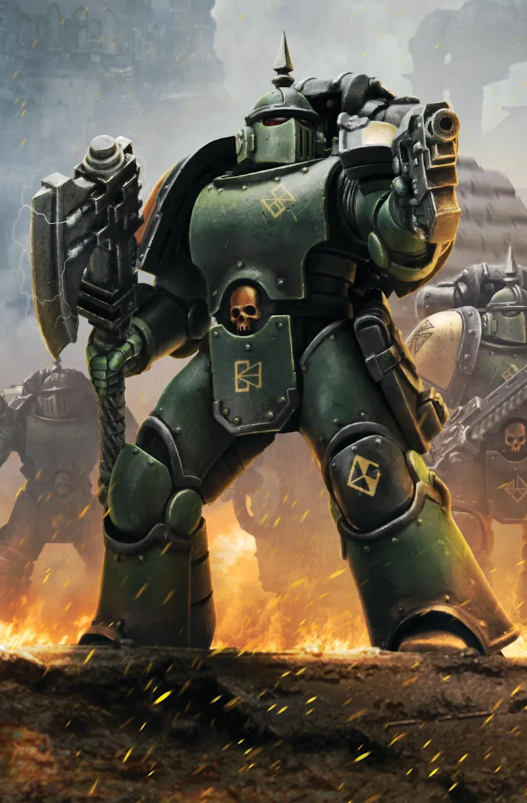

# Horus Heresy · Guide d'initiation

Site statique **non officiel** servant de guide d'initiation au jeu de figurines **Warhammer : The Horus Heresy** (3ᵉ édition), en français. Pensé pour être consulté **sur téléphone pendant une partie** : règles résumées, tables de référence interactives et configurateur de liste d'armée.

## Aperçu

<!-- TODO : remplacer par une vraie capture d'écran du site
     (ex : docs/screenshot.png, prise sur mobile ET bureau) -->



## Démo en ligne

👉 **[jean-desaintangel.github.io/horus_heresy](https://jean-desaintangel.github.io/horus_heresy/)**

## Fonctionnalités principales

- **Règles résumées par phase** : construction d'armée, tour de jeu, mouvement, tir, assaut, défi, statuts & réactions.
- **Tables de référence interactives** (CC, Blessure, CT) : surbrillance ligne/colonne au survol, épinglage d'une case au tap sur mobile, première colonne figée au défilement horizontal.
- **Glossaire des règles spéciales** avec recherche instantanée (insensible aux accents).
- **Arsenal** : tables d'armes filtrables, avec info-bulle de définition sur chaque règle spéciale.
- **Configurateur d'unités** : composez votre liste (variantes, options d'armement), coût en points recalculé en direct, fiche récap imprimable, export **PDF** et **Word** en un clic, sauvegarde locale (`localStorage`).
- **Assistant de Sélection d'Armée** (Legio Astartes, Legio Titanicus, Chevaliers Questoris) : organigramme de détachements conforme aux livres d'armée respectifs (Détachement Principal, Auxiliaires, Apex, Détachements Additionnels de Maisonnée, quotas Seigneur de Guerre/Seigneurs des Batailles, Alliés…), validation en temps réel des règles de construction.
- **Pages de règles dédiées** : Véhicules (blindage, transports, Sous-types Rapide/Stable/Super-lourd/Titan/Chevalier), Titans (Legio Titanicus) et Chevaliers Questoris (Paradigmes de Maisonnée, Vœux Questoris, Réactions Avancées).
- **Téléchargements** : aides de jeu maison et documents communautaires.
- **Accessibilité soignée** : lien d'évitement, `aria-current`, `aria-expanded`, contrastes WCAG AA vérifiés, focus visible, tooltips accessibles au clavier.
- **RGPD** : polices auto-hébergées, aucune requête vers un tiers, aucune donnée collectée.

## Arborescence du projet

```text
horus_heresy/
├── index.html               # Page d'accueil (hero + navigation)
├── pages/                   # Pages secondaires (une par section)
│   ├── tour.html            # Les 5 phases d'un tour de jeu (timeline)
│   ├── mouvement.html       # Phase de Mouvement
│   ├── tir.html             # Phase de Tir + tables de référence
│   ├── assaut.html          # Phase d'Assaut + tables de référence
│   ├── defi.html            # Sous-phase de Défi (Postures, Concentration…)
│   ├── statuts-reactions.html # Statuts tactiques et réactions
│   ├── vehicule.html        # Règles des Véhicules (blindage, transports,
│   │                        # Sous-types dont Chevalier…)
│   ├── titan.html           # Règles des Titans (Legio Titanicus)
│   ├── chevaliers-questoris.html # Règles des Chevaliers Questoris
│   │                        # (Paradigmes de Maisonnée, Vœux, Réactions)
│   ├── psy.html             # Aptitudes Psychiques (Pouvoirs, Périls du Warp…)
│   ├── regles.html          # Glossaire des règles spéciales (recherche)
│   ├── armes.html           # Arsenal : tables d'armes filtrables
│   ├── unites.html          # Configurateur de liste d'armée
│   ├── telechargement.html  # Documents à télécharger
│   └── contact.html         # Formulaire de signalement (Formspree)
├── css/
│   └── style.css            # Feuille de style unique, mobile-first,
│                            # variables CSS nommées par rôle
├── js/                      # JavaScript vanilla, sans dépendance
│   ├── main.js              # Commun : menu burger, accordéons,
│   │                        # timeline, sections repliables, tooltips
│   ├── tables.js            # Tables de référence 2D (tir, assaut)
│   ├── regles.js            # Rendu + recherche des règles spéciales
│   ├── regles-data.js       # Données : textes des règles spéciales
│   ├── armes.js             # Rendu + filtrage des tables d'armes
│   ├── armes-data.js        # Données : caractéristiques des armes
│   ├── unites.js            # Logique du configurateur d'unités
│   ├── unites-data.js       # Données : fiches d'unités + équipements
│   ├── organigramme.js      # Assistant de Sélection d'Armée (détachements)
│   ├── organigramme-data.js # Données : détachements, avantages, quotas
│   ├── contact.js           # Envoi AJAX du formulaire de signalement
│   └── vendor/               # jsPDF + AutoTable, auto-hébergées (export PDF)
└── assets/
    ├── fonts/               # Cinzel & Lato auto-hébergées (WOFF2)
    ├── img/                 # Favicon, illustration d'accueil
    ├── logo_legions/        # Logos des 18 Légions Astartes (PNG)
    ├── logo_titan/          # Blasons Legio Titanicus (PNG)
    └── documents/           # Fichiers proposés au téléchargement
```

**Convention** : les fichiers `*-data.js` ne contiennent **que des données** (transcriptions des livres) ; la logique de rendu vit dans le fichier du même nom sans suffixe. Pour corriger une valeur de jeu, on ne touche donc qu'aux `-data.js`.

## Technologies utilisées

- **HTML5 / CSS3 / JavaScript vanilla** — aucun framework, aucune étape de build. Seule exception : [jsPDF](https://github.com/parallax/jsPDF) + [AutoTable](https://github.com/simonbengtsson/jsPDF-AutoTable) (`js/vendor/`, MIT), auto-hébergées comme les polices, pour l'export PDF du configurateur d'unités. L'export Word ne nécessite aucune dépendance (fichier `.doc` au format HTML).
- **Mobile-first** : les styles de base ciblent le petit écran, les media queries `min-width` enrichissent pour le bureau.
- **Sécurité** : tout le texte est injecté via `textContent` (jamais `innerHTML`) — réflexe anti-XSS.
- Hébergement : **GitHub Pages**.

## Installation locale

```bash
# 1. Cloner le dépôt
git clone https://github.com/jean-desaintangel/horus_heresy.git
cd horus_heresy

# 2a. Ouvrir directement index.html dans un navigateur (aucun serveur requis)
# ou
# 2b. Servir le dossier avec un serveur statique :
npx serve .
# puis ouvrir http://localhost:3000
```

Le site fonctionne intégralement en `file://` : c'est un choix assumé (voir ci-dessous).

## Choix techniques assumés

- **Polices auto-hébergées** (`assets/fonts/`, issues du paquet npm `@fontsource`) plutôt que Google Fonts : aucune IP de visiteur transmise à un tiers (RGPD / CNIL) et chargement plus rapide.
- **Nav et pied de page centralisés en JS** (`js/main.js`, tableau `LIENS_NAV`) : chaque page ne porte qu'un conteneur vide (`<ul class="nav-menu">`, `<footer>`), rempli au chargement — évite la duplication tout en restant consultable en `file://` (une inclusion via `fetch()` échouerait à cause de CORS). Toute nouvelle page doit être ajoutée à `LIENS_NAV` pour apparaître dans le menu des **16 pages** du site (`index.html` + les 15 pages de `pages/`).
- **Pas de Content-Security-Policy en `<meta>`** : la source `'self'` est inopérante en `file://`. GitHub Pages ne permettant pas de définir des en-têtes HTTP personnalisés, une CSP devra attendre un éventuel changement d'hébergeur.
- **Open Graph** : les balises `og:` sont présentes, mais `og:image` exige une URL absolue — à compléter maintenant que le domaine est connu.

## Formulaire de signalement (Formspree)

La page `pages/contact.html` permet aux visiteurs de signaler une erreur ou de proposer une amélioration. Le site étant **statique** (GitHub Pages, aucun serveur PHP), l'envoi du mail est délégué à [Formspree](https://formspree.io).

## Contribuer / s'approprier le code

Les contributions sont bienvenues : correction d'une valeur de jeu, faute d'orthographe, nouvelle unité dans le configurateur, amélioration d'accessibilité…

1. **Forkez** le dépôt (bouton _Fork_ en haut de la page GitHub).
2. Créez une branche : `git checkout -b correction-profil-praetor`.
3. Faites vos modifications (les fichiers `js/*-data.js` sont le point d'entrée le plus fréquent).
4. Ouvrez une **Pull Request** en décrivant le changement et, pour une valeur de jeu, la **page du livre** qui fait référence.

Vous voulez adapter le site pour une autre communauté (autre langue, autre système de jeu) ? Forkez et faites-vous plaisir — c'est prévu pour.

## Licence

Le **code** (HTML, CSS, JS) est sous licence **[MIT](LICENSE)** : vous pouvez le copier, le modifier et le redistribuer librement, y compris commercialement, à condition de conserver la mention de copyright. C'est la licence la plus simple et la plus permissive pour encourager les forks.

⚠️ **La licence MIT ne couvre que le code.** Les noms, l'univers et les valeurs de jeu de _Warhammer : The Horus Heresy_ restent la propriété intellectuelle de **Games Workshop Ltd**. Les documents du dossier `assets/documents/` conservent la licence de leurs auteurs respectifs.

## Contact / crédits

- **Auteur** : Jean — [ouvrir une issue](https://github.com/jean-desaintangel/horus_heresy/issues) pour toute question ou suggestion.
- **Communauté** : groupe Facebook [Horus Heresy France](https://www.facebook.com/groups/1881902328756053).
- Merci à **Sgt Furius** pour la fiche « Postures de défi ».

---

_Guide non officiel réalisé par des fans bénévoles francophones. Horus Heresy, Warhammer : The Horus Heresy et tous les noms associés sont des marques déposées de Games Workshop Ltd. Ce site n'est ni affilié ni approuvé par Games Workshop._
